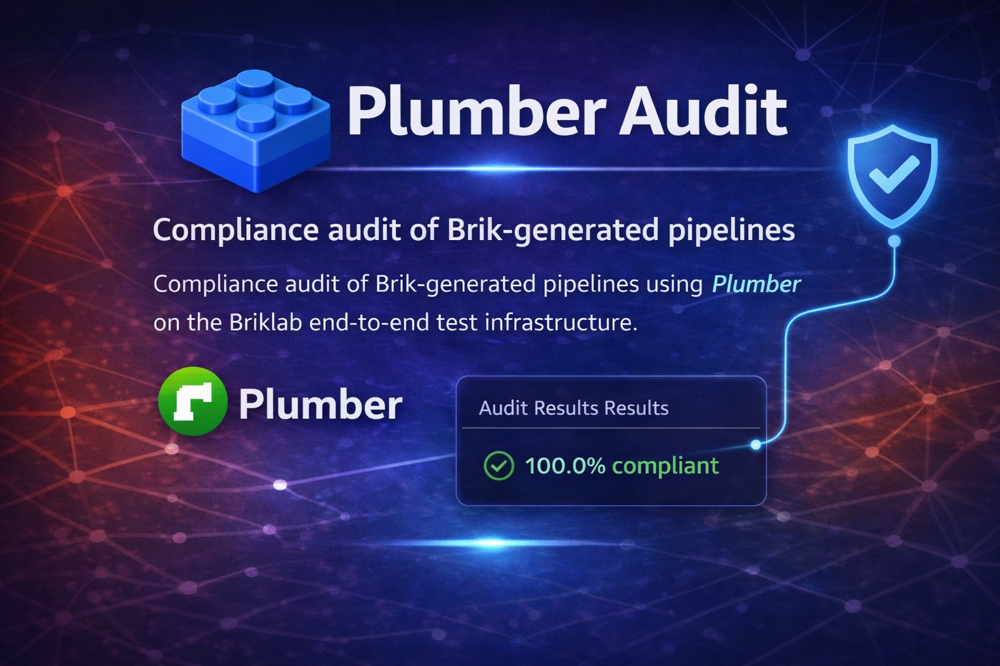

<p align="center">
  
</p>

Compliance audit of Brik-generated pipelines using [Plumber](https://getplumber.io/) v0.1.81 (latest) on the Briklab end-to-end test infrastructure.

## What is Plumber?

Plumber is an open-source CLI compliance scanner for GitLab CI/CD pipelines. It checks for:

- Container image pinning (digest, forbidden tags)
- Authorized image sources
- Branch protection
- Hardcoded jobs (vs. reusable templates/components)
- Include versioning (up-to-date, no forbidden versions)
- Debug trace detection
- Unsafe variable expansion
- Security job weakening
- Job variable overrides
- Unverified script execution (curl | bash)
- Docker-in-Docker usage

## Results (2026-04-03)

### brik/node-minimal - 100.0% compliant

The only project with a `.gitlab-ci.yml` on Briklab. Uses the Brik fixed-flow pipeline via `include:` from `brik/gitlab-templates`.

| Control | Compliance | Issues |
|---------|-----------|--------|
| Container images must not use forbidden tags (pinned by digest) | 100.0% | 0 |
| Container images must come from authorized sources | 100.0% | 0 |
| Branch must be protected | 100.0% | 0 |
| Pipeline must not include hardcoded jobs | 100.0% | 0 |
| Includes must be up to date | 100.0% | 0 |
| Includes must not use forbidden versions | 100.0% | 0 |
| Pipeline must not enable debug trace | 100.0% | 0 |
| Pipeline must not use unsafe variable expansion | 100.0% | 0 |
| Security jobs must not be weakened | 100.0% | 0 |
| Pipeline must not execute unverified scripts | 100.0% | 0 |
| Pipeline must not override job variables | 100.0% | 0 |
| Pipeline must not use Docker-in-Docker | 100.0% | 0 |


### Other projects

- `brik/gitlab-templates` - No `.gitlab-ci.yml` (template repository)
- `brik/brik` - No `.gitlab-ci.yml` (mirror)
- `root/brik-test` - No `.gitlab-ci.yml`

## Key observations

1. **Brik pipelines score 100%** - all 12 controls pass after the digest pinning fix.
2. **Template-based approach works well** - the `include:` pattern gets 100% on the "no hardcoded jobs" check, validating Brik's core value proposition.
3. **Branch protection** is correctly configured on the default branch.
4. **No security anti-patterns** detected (no debug trace, no unsafe variable expansion, no curl-pipe-bash, no DinD).

## Relevance to Brik

Plumber validates several things that align with Brik's goals:
- Enforcing reusable templates over hardcoded jobs (Brik's core value proposition)
- Detecting supply chain risks in CI/CD (image pinning, unverified scripts)
- Checking branch protection and security job integrity

Potential integration: Brik could recommend Plumber as a companion tool for compliance auditing of pipelines generated by the Brik shared library.

## Files

```
plumber-audit/
  .plumber.yaml              # Plumber configuration (default)
  reports/
    node-minimal.json        # Report after digest pinning fix (100%)
    gitlab-templates.json
    brik.json
    brik-test.json
```

## Usage

```bash
export GITLAB_TOKEN=<your-gitlab-pat>
plumber analyze --gitlab-url http://localhost:8929 --project brik/node-minimal
```
